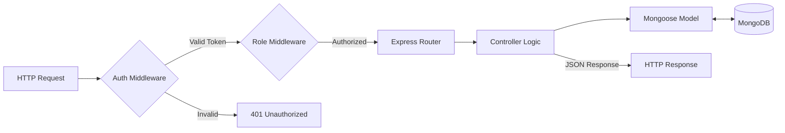
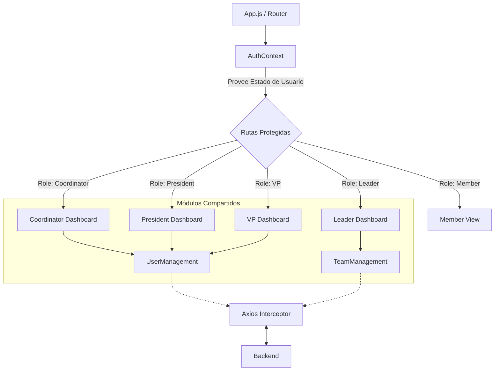

# Sistema de Gestión de Recursos Humanos - Club de Debate

Este proyecto es una plataforma web integral diseñada para la gestión eficiente de los miembros, líderes y directiva de un Club de Debate Universitario. Implementa una arquitectura **MERN Stack** (MongoDB, Express, React, Node.js) y se centra en el control de acceso basado en roles (RBAC), gestión de asistencias, tareas y organización de equipos.

## 🚀 Arquitectura y Tecnologías

El sistema sigue una arquitectura Cliente-Servidor separada:

*   **Frontend**: SPA (Single Page Application) construida con **React.js**. Utiliza **React Bootstrap** para el diseño responsivo y **Axios** para la comunicación con la API.
*   **Backend**: API RESTful construida con **Node.js** y **Express**.
*   **Base de Datos**: **MongoDB** con **Mongoose** como ODM.
*   **Seguridad**: Autenticación mediante **JWT (JSON Web Tokens)** y hashing de contraseñas con **bcrypt**.
*   **Control de Versiones**: Git.

## 📐 Diagramas de Arquitectura

### Arquitectura General
```mermaid
graph TD
    User((Usuario)) -->|Navegador| Frontend[Frontend React]
    Frontend <-->|HTTP Requests (Axios)| Backend[Backend Node/Express]
    Backend <-->|Mongoose Queries| DB[(MongoDB Database)]
```

### Arquitectura Backend
El backend sigue el patrón MVC (Model-View-Controller) modificado para API REST.



### Arquitectura Frontend
Organización de componentes y vistas protegidas por rol.



## 👥 Roles y Permisos

El sistema implementa una jerarquía estricta de roles para mantener la integridad de la organización:

1.  **Coordinador Estratégico (Admin)**: 
    *   Máxima autoridad del sistema.
    *   Gestiona mandatos (activa/desactiva Presidentes y Vicepresidentes).
    *   Visualización de estadísticas globales y control total de usuarios.
2.  **Presidente**:
    *   Gestión de Vicepresidentes y Líderes.
    *   Supervisión de prácticas y tareas globales.
3.  **Vicepresidente**:
    *   Apoyo en la gestión operativa.
    *   Visualización de estadísticas de su área.
4.  **Líder de Equipo**:
    *   Gestión directa de sus miembros asignados (Mi equipo).
    *   Asignación de tareas específicas.
    *   Control de asistencia a prácticas.
5.  **Miembro**:
    *   Visualización de perfil, asistencias y tareas asignadas.

## ✨ Características Principales

### 1. Gestión de Usuarios y Mandatos
*   **CRUD Completo**: Creación, lectura, actualización y eliminación de usuarios.
*   **Control de Mandatos**: Sistema inteligente que impide tener más de un Presidente o Coordinador activo simultáneamente.
*   **Activación/Desactivación**: Los usuarios inactivos pierden automáticamente el acceso a paneles directivos y se degradan a vista de miembro.

### 2. Gestión de Directiva y Equipos
*   **Directiva Actual**: Panel visual para ver rápidamente a los responsables activos (Coordinador, Presidente, VP).
*   **Asignación de Equipos**: Los líderes pueden seleccionar miembros disponibles para formar sus equipos de trabajo.

### 3. Tareas y Prácticas
*   **Seguimiento de Tareas**: Asignación y cambio de estado de tareas.
*   **Calendario de Prácticas**: Programación de sesiones de entrenamiento.
*   **Control de Asistencia**: Registro de asistencias para generar estadísticas de participación.

### 4. Dashboards Personalizados
*   Cada rol tiene un panel de control único con métricas (KPIs) relevantes para su función (ej. Total de miembros, % de asistencia, Tareas pendientes).

## 🛠 Instalación y Configuración

### Prerrequisitos
*   Node.js (v14 o superior)
*   MongoDB Atlas URI (o local)
*   Git

### Pasos de Instalación

1.  **Clonar el repositorio**
    ```bash
    git clone https://github.com/kiboki1234/Sistema-de-recursos-humanos.git
    cd Sistema-de-recursos-humanos
    ```

2.  **Configurar Backend**
    ```bash
    cd backend
    npm install
    ```
    Crea un archivo `.env` en `backend/` con:
    ```env
    PORT=5000
    MONGO_URI=tu_mongo_uri
    JWT_SECRET=tu_secreto_jwt
    ```

3.  **Configurar Frontend**
    ```bash
    cd ../frontend
    npm install
    ```

4.  **Cargar Datos de Prueba (Seed)**
    Para poblar la base de datos con usuarios y roles iniciales:
    ```bash
    cd backend
    node seedDataComplete.js
    ```
    *(Esto creará un Coordinador por defecto: email `ana.torres@example.com`, pass `password123`)*

5.  **Ejecución en Desarrollo**
    Necesitas dos terminales:
    *   Terminal 1 (Backend): `cd backend && npm start`
    *   Terminal 2 (Frontend): `cd frontend && npm start`

## 📂 Estructura del Proyecto

```
.
├── backend/
│   ├── config/         # Configuración de DB y JWT
│   ├── controllers/    # Lógica de negocio
│   ├── models/         # Esquemas de Mongoose
│   ├── routes/         # Definición de rutas API
│   ├── middlewares/    # Protección de rutas y manejo de roles
│   └── server.js       # Punto de entrada del servidor
│
├── frontend/
│   ├── public/
│   └── src/
│       ├── components/ # Componentes reutilizables (AuthContext, Navbar)
│       ├── pages/      # Vistas por rol (presidentView, memberView, etc.)
│       ├── api.js      # Configuración de Axios
│       └── App.js      # Enrutamiento principal
│
└── README.md           # Documentación
```

---
Desarrollado para el Proyecto de Calidad de Software.
